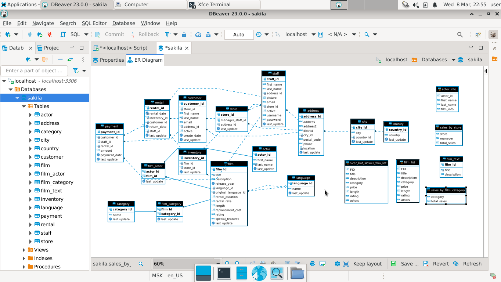
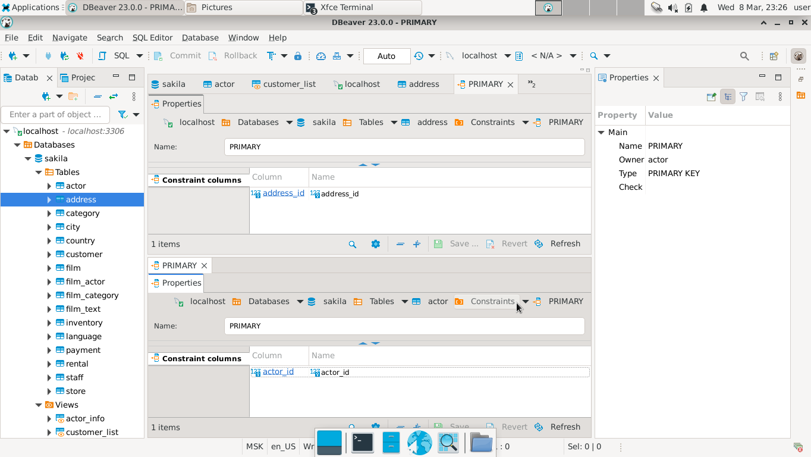

# Домашнее задание к занятию 12.2. «Работа с данными (DDL/DML)» - `Елена Махота`

- [Ответ к Заданию 1](#1)
- [Ответ к Заданию 2](#2)
- [Ответ к Заданию 3*](#3)


---

Задание можно выполнить как в любом IDE, так и в командной строке.

### Задание 1
1.1. Поднимите чистый инстанс MySQL версии 8.0+. Можно использовать локальный сервер или контейнер Docker.

1.2. Создайте учётную запись sys_temp. 

1.3. Выполните запрос на получение списка пользователей в базе данных. (скриншот)

1.4. Дайте все права для пользователя sys_temp. 

1.5. Выполните запрос на получение списка прав для пользователя sys_temp. (скриншот)

1.6. Переподключитесь к базе данных от имени sys_temp.

Для смены типа аутентификации с sha2 используйте запрос: 
```sql
ALTER USER 'sys_test'@'localhost' IDENTIFIED WITH mysql_native_password BY 'password';
```
1.6. По ссылке https://downloads.mysql.com/docs/sakila-db.zip скачайте дамп базы данных.

1.7. Восстановите дамп в базу данных.

1.8. При работе в IDE сформируйте ER-диаграмму получившейся базы данных. При работе в командной строке используйте команду для получения всех таблиц базы данных. (скриншот)

*Результатом работы должны быть скриншоты обозначенных заданий, а также простыня со всеми запросами.*

### *<a name = "1"> Ответ к Заданию 1</a>*

**Установка  и запуск DBeaver **
```bash
wget https://dbeaver.io/files/dbeaver-ce_latest_amd64.deb
sudo dpkg -i dbeaver-ce_latest_amd64.deb
dbeaver &
```


1.1. Поднят чистый инстанс MySQL версии 8.0.32-debian с помощью контейнера Docker.

```bash
mkdir mysql

docker run -dp 3306:3306 \
--name makhota-mysql \
-v mysql:/var/lib/mysql \
-e MYSQL_ROOT_PASSWORD=1 \
mysql:8.0.32-debian
```


1.2. Создана учётная запись sys_temp. 

```bash
docker exec -it makhota-mysql mysql -uroot -p
Enter password: 1
CREATE USER 'sys_temp'@'localhost' IDENTIFIED BY '1';
```

1.3. Выполнен запрос на получение списка пользователей в базе данных. 

```bash
SELECT user FROM mysql.user;
```


1.4. Выданы все права для пользователя sys_temp. 

```sql
GRANT ALL PRIVILEGES ON mysql . * TO 'sys_temp'@'localhost';
```

1.5. Выполнен запрос на получение списка прав для пользователя sys_temp. 

```sql
SHOW GRANTS FOR 'sys_temp'@'localhost';
```


1.6. Выполнено переподключение к базе данных от имени sys_temp.

```sql
ALTER USER 'sys_temp'@'localhost' IDENTIFIED WITH mysql_native_password BY '1';
SELECT user();
```


1.6. По ссылке https://downloads.mysql.com/docs/sakila-db.zip скачан дамп базы данных, затем распакован.

```bash
wget https://downloads.mysql.com/docs/sakila-db.zip
unzip sakila-db.zip
```

1.7. Восстановите дамп в базу данных.

```bash
user@makhota-vm10:~$ docker cp ./sakila-db/sakila-schema.sql makhota-mysql:/tmp
Preparing to copy...
Copying to container - 26.11kB
Successfully copied 26.11kB to makhota-mysql:/tmp
user@makhota-vm10:~$ docker cp ./sakila-db/sakila-data.sql makhota-mysql:/tmp
Preparing to copy...
...
Successfully copied 3.354MB to makhota-mysql:/tmp
user@makhota-vm10:~$ docker exec -it makhota-mysql bash
root@87c55ac2d0c8:/# mysql -u root -p sakila-db < /tmp/sakila-schema.sql 
Enter password: 1
root@87c55ac2d0c8:/# mysql -u root -p sakila < /tmp/sakila-data.sql 
Enter password: 1
root@87c55ac2d0c8:/# exit                                                
exit
```


1.8. При работе в командной строке использована команда для получения всех таблиц базы данных. 
При работе в IDE сформирована ER-диаграмма получившейся базы данных. 

```sql
mysql> SHOW DATABASES;
+--------------------+
| Database           |
+--------------------+
| information_schema |
| mysql              |
| performance_schema |
| sakila             |
| sys                |
+--------------------+
5 rows in set (0.01 sec)

mysql> USE sakila
Reading table information for completion of table and column names
You can turn off this feature to get a quicker startup with -A

Database changed
mysql> SHOW TABLES;
+----------------------------+
| Tables_in_sakila           |
+----------------------------+
| actor                      |
| actor_info                 |
| address                    |
| category                   |
| city                       |
| country                    |
| customer                   |
| customer_list              |
| film                       |
| film_actor                 |
| film_category              |
| film_list                  |
| film_text                  |
| inventory                  |
| language                   |
| nicer_but_slower_film_list |
| payment                    |
| rental                     |
| sales_by_film_category     |
| sales_by_store             |
| staff                      |
| staff_list                 |
| store                      |
+----------------------------+
23 rows in set (0.01 sec)

mysql> 
```


---

### Задание 2
Составьте таблицу, используя любой текстовый редактор или Excel, в которой должно быть два столбца: в первом должны быть названия таблиц восстановленной базы, во втором названия первичных ключей этих таблиц. Пример: (скриншот/текст)
```
Название таблицы | Название первичного ключа
customer         | customer_id
```

### *<a name = "2"> Ответ к Заданию 2</a>*

```sql

mysql>  SELECT TABLE_NAME, COLUMN_NAME FROM INFORMATION_SCHEMA.key_column_usage WHERE table_schema = 'sakila' AND CONSTRAINT_NAME = 'PRIMARY';
+---------------+--------------+
| TABLE_NAME    | COLUMN_NAME  |
+---------------+--------------+
| actor         | actor_id     |
| address       | address_id   |
| category      | category_id  |
| city          | city_id      |
| country       | country_id   |
| customer      | customer_id  |
| film          | film_id      |
| film_actor    | actor_id     |
| film_actor    | film_id      |
| film_category | film_id      |
| film_category | category_id  |
| film_text     | film_id      |
| inventory     | inventory_id |
| language      | language_id  |
| payment       | payment_id   |
| rental        | rental_id    |
| staff         | staff_id     |
| store         | store_id     |
+---------------+--------------+
18 rows in set (0.01 sec)

```



---

## Дополнительные задания (со звёздочкой*)
Эти задания дополнительные, то есть не обязательные к выполнению, и никак не повлияют на получение вами зачёта по этому домашнему заданию. Вы можете их выполнить, если хотите глубже шире разобраться в материале.

### Задание 3*
3.1. Уберите у пользователя sys_temp права на внесение, изменение и удаление данных из базы sakila.

3.2. Выполните запрос на получение списка прав для пользователя sys_temp. (скриншот)

*Результатом работы должны быть скриншоты обозначенных заданий, а также простыня со всеми запросами.*

### *<a name = "3"> Ответ к Заданию 3*</a>*


3.1. Удалены у пользователя sys_temp права на внесение, изменение и удаление данных из базы sakila.

```sql
REVOKE INSERT  ON sakila . * FROM 'sys_temp'@'localhost';
REVOKE DELETE  ON sakila . * FROM 'sys_temp'@'localhost';
REVOKE CREATE  ON sakila . * FROM 'sys_temp'@'localhost';
REVOKE ALTER   ON sakila . * FROM 'sys_temp'@'localhost';
REVOKE DROP   ON sakila . * FROM 'sys_temp'@'localhost';
```

3.2. Выполнен запрос на получение списка прав для пользователя sys_temp. 

```sql 
SHOW GRANTS FOR 'sys_temp'@'localhost'
```


